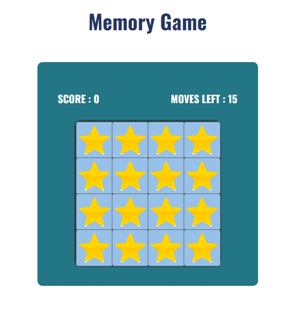

# Memory Game - JS
## Techniques Used
- html
- css
- Java Script

### Time Taken : 1 day

### Features Added to the project:
- Game instructions are added in note container.
- When you press start button game will get loaded.
- For each correct match score will be added and after every matching(correct or wrong) moves will get reduced.
- After finishing game result container will be displayed which shows your winning status and score.
- There is a restart button to retry the game.

;